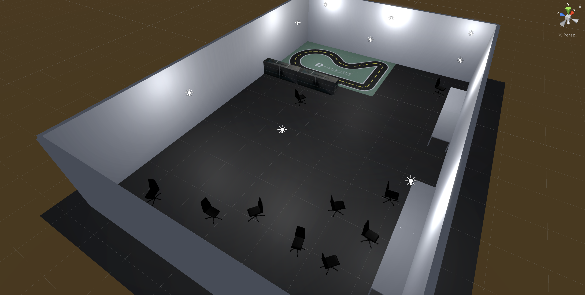

# Master Thesis

In this repository, I share code, models and datasets used in my empirical studies throughout my Master Thesis in Artificial Intelligence (2021).

## 1 - Requisites
Python3, git 64 bit, miniconda 3.7 64 bit.
To modify the simulator (optional): Unity 2019.3.0f1

## 2 - Set-up
### 2.1 - Git LFS
To access the pre-trained keras models (.h5 files), you will need to use [git lfs](https://git-lfs.github.com/).   

### 2.2 - Donkey Car
Make sure you correctly install the [donkey car software](http://docs.donkeycar.com/guide/install_software/), the necessary [simulator software](http://docs.donkeycar.com/guide/simulator/) and [my personal version of the simulator executable](https://github.com/BrianPulfer/sdsandbox/tree/master/binaries/usi_track_v2/) (<b>MacOS</b> only for the moment).

### 2.3 - Own files
Replace the following files in your /mycar/  project with the ones found in this repository:
<ul>
<li>calibrate.py</li>
<li>manage.py</li>
<li>myconfig.py</li>
<li>train.py</li>
</ul>
Also add the /thesis folder you find in this repository in your /mycar/ folder. 
 
Finally, change the path of the simulator `DONKEY_SIM_PATH` in the myconfig.py file with the path to my own version of the simulator. Optionally, modify personal information like the car name and others.
## 3 - Credits
Credits to [Tawn Kramer](https://github.com/tawnkramer) and [DonkeyCar community](https://www.donkeycar.com/community.html) for providing the framework.